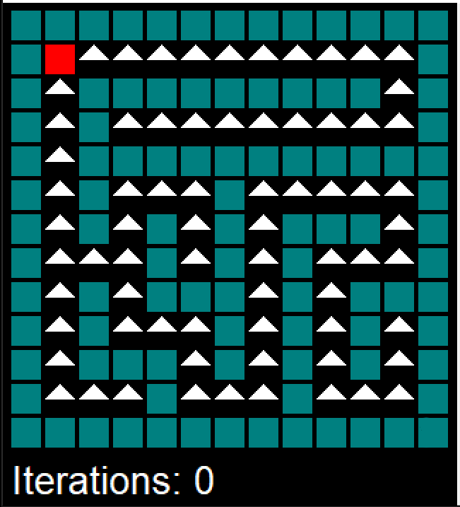
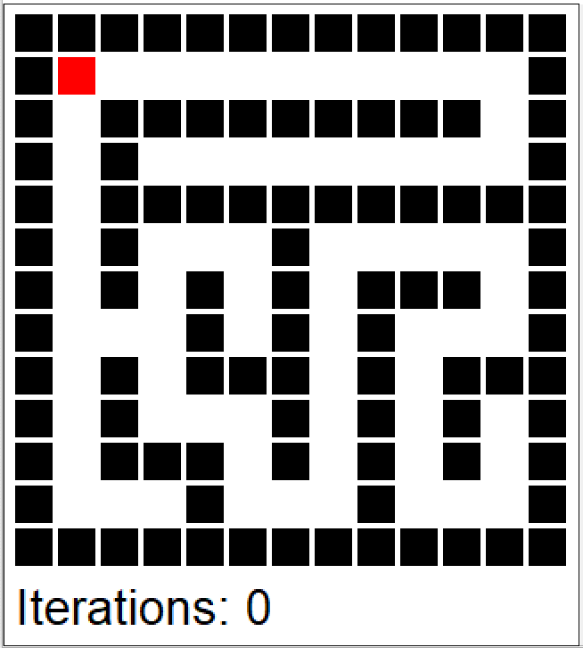
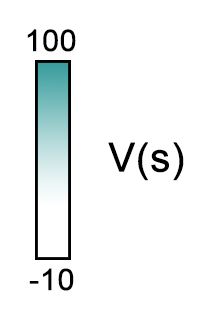

# Maze Solver
Exploring MDP solving algorithms with mazes!

****

## Introduction:
We generate random maze and sovle using two basic algorithms for solving MDPs are value iteration
and policy iteration.
## Methods:
  **1. Value Iteration**
  
   The value iteration approach finds the optimal policy π* by calculating the optimal value
   function, V*. Starting with V(s) = 0 for all states s, the values of each state are iteratively
   updated to get the next value function V, which converges towards V*.
      
   

      
  **2. Policy Iteration**
  
   Starting with a random policy π0 , this approach consists of two steps:
      
   I. Calculate the utilities of a non-optimal policy πi
            
   

            
   II. Update the policy using the resulting converged utilities from the previous step to obtain πi+1.
            
   

        
   These steps are repeated until π converges to π*
## Sample Run
Policy Iteration           |  Value Iteration          |  Scale
:-------------------------:|:-------------------------:|:-------------------------:
 |   | 

## Authors

* **Mohamed Bakr** [MohamedBakrAli](https://github.com/MohamedBakrAli)

## License

This project is licensed under the MIT License - see the [LICENSE](LICENSE) file for details
